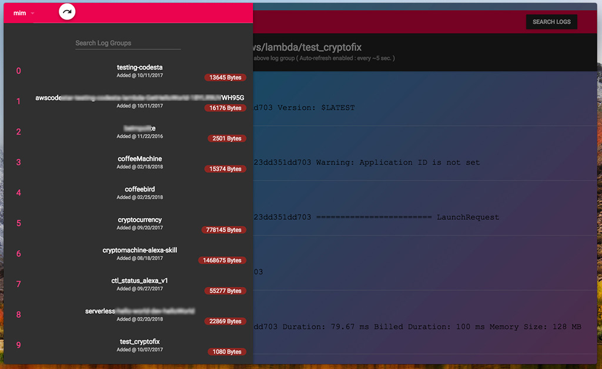
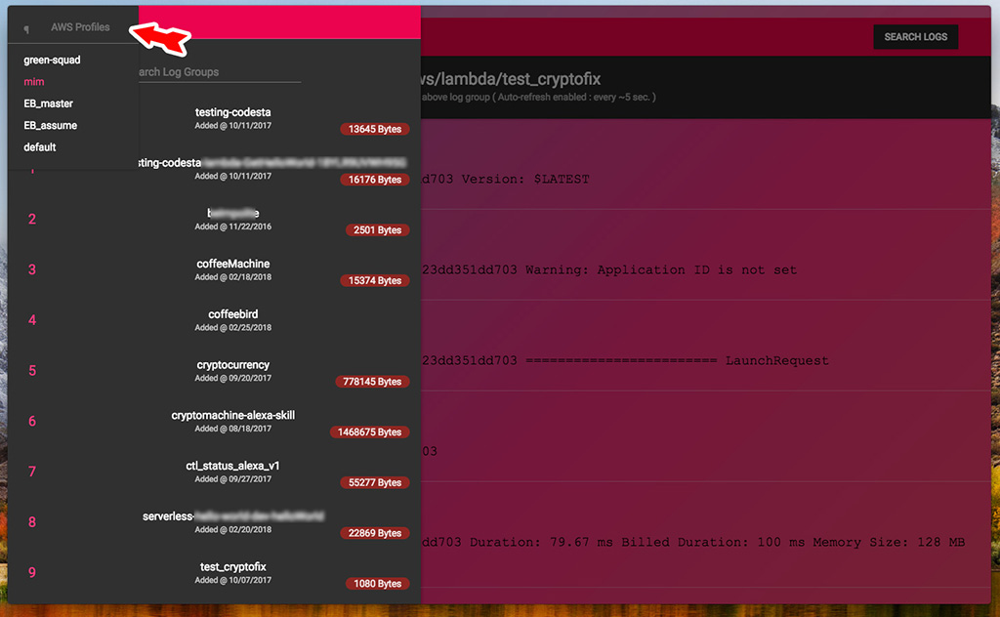
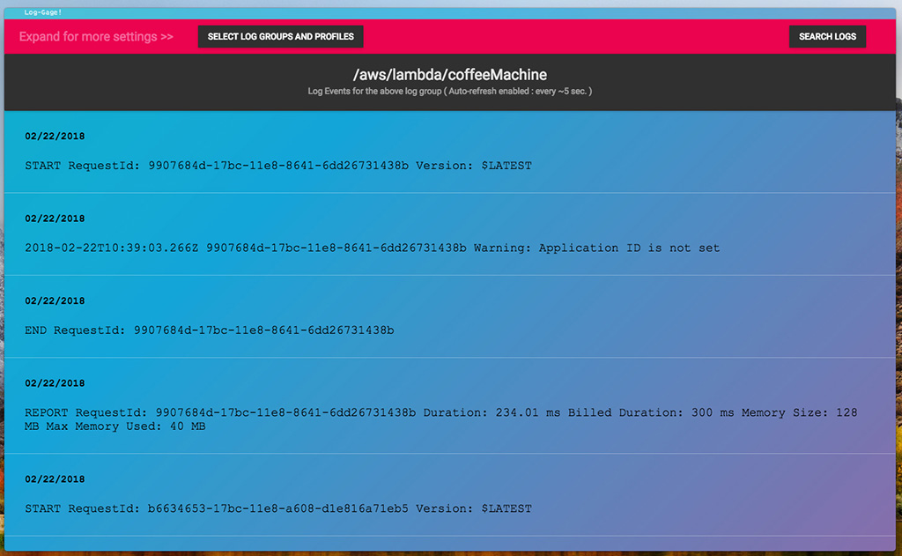
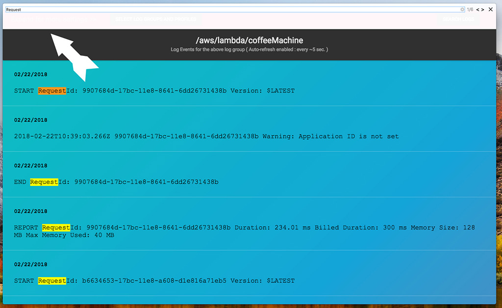

# AWS Log-Gage
An standalone, open-source tooling application for AWS Cloud-Watch logs.


## Screen-shots:

Log vies and AWS profiles list to select (Supports suggestion / filtering of the log-groups) :



Multi-AWS-profiles on the same machine is supported:



Left drawer closed ( just the searchable console ):



Search the log contents functionality ( it also search the whole pages content ):




<!-- CircleCI-Build: [](https://circleci.com/gh/mim-Armand/TwiTool) -->

<!-- [](https://gemnasium.com/github.com/mim-Armand/status.ctl.alexa.skill) -->


## Install
NPM package place holder:
`https://www.npmjs.com/package/log-gage`

# To run:
`yarn start`

To run/test in Chrome we need to enable CORS temporarily by running`open -a Google\ Chrome --args --disable-web-security --user-data-dir`

# To build:
`yran build`

# To Release:
#### Locally (Your platform):
`yarn release`
#### Through CI (Multi-platform):
Release candidates should have the combination word `release candidate` in the commit message otherwise the **CI** pipelines will just build the project and run the tests but won't publish the release to GitHub releases as a draft.
> In travis ci, the GH_TOKEN should be set to the token obtained from github ( so it can push the release draft )

## Mac OSX:

### Code Signing:

#### For distribution outside of apple store:

 > https://www.electron.build/code-signing#where-to-buy-code-signing-certificate

1. create a *CSR* file ( Keychain Access > Certificate Assistance > Request a ... )
2. Go to [Apple Developer](https://developer.apple.com/account/mac/certificate/distribution) and create two following certs using the above CSR file ( macOS > Production >> )
    * Developer ID Application ( to sign the app )
    * Developer ID Installer ( to sign the installer )
3. Create a `.p12` file ( Keychain > keys > find the one you want > right click > export ) ( a password is required )
4. Base64 encode the file ( `$ base64 ./LoggageCertificates.p12 > ./LoggageCertificates.p12.base64` )
    > [Here](http://jviotti.com/2016/03/16/how-to-code-sign-os-x-electron-apps-in-travis-ci.html) is a brief tut for these steps.
5. set these env vars in Travis settings:
    * `CSC_KEY_PASSWORD` And `CERTIFICATE_PASSWORD` = the password above
    * `CERTIFICATE_P12` and `CSC_LINK` = to the above base64 hash.
    * `CSC_IDENTITY_AUTO_DISCOVERY` = `true`
6. With the following script already in `.travis.yml` file, everything's set and runing the build should release a signed app!
```bash
if [[ "$TRAVIS_OS_NAME" == "osx" ]]; then
      export CERTIFICATE_P12=Certificate.p12; \
      echo $CERTIFICATE_OSX_P12 | base64 --decode > $CERTIFICATE_P12; \
      export KEYCHAIN=build.keychain; \
      security create-keychain -p thetemporarytransientpassword $KEYCHAIN; \
      security default-keychain -s $KEYCHAIN; \
      security unlock-keychain -p thetemporarytransientpassword $KEYCHAIN; \
      security import $CERTIFICATE_P12 -k $KEYCHAIN -P $CERTIFICATE_PASSWORD -T /usr/bin/codesign; \
      npm run release; \
    fi;
```

#### For MAS (Mac Application Store):
 > Publishing to MAS is not supported at this time only due to not having enough time add all the required permissions and handle errors and all the additional required logic in addition of the debugging over-head it may have.
 > We may add MAS support in the future if we receive a good feedback, contribution in the aspect is very much welcomed and appreciated as well.


#### ICON:
Use [IconUtil](https://developer.apple.com/library/content/documentation/GraphicsAnimation/Conceptual/HighResolutionOSX/Optimizing/Optimizing.html) from Apple to make icons for OSX.


## Contribution notes:
 * Please note, if **Travis** failed, first try to purge the cache ( often times it fixes the problem! )


## TODO:
- [ ]  add more stuff to do!
- [ ] Add/Edit the app icon/logo ( currently borrowed from TwiTool! )
- [ ] Publish to App store (?!)
- [ ] The maximize/Minimize functionality is gone ( not visible anymore! ), fix it
- [ ] Support more ( or all ) regions ( right now, for the sake of time-to-market, `us-east-1` is hard-coded )
- [ ] Add support for other platforms
- [ ] Add Auto-Update functionality

## Done:
- [x] ( component LeftDrawer ) >> test if array is empty show a man page and link to AWS docs to create profiles, if only one item ( default ) don't show the drop-down ( just metion default profile in use )
- [x] Added search in logs functionality ( using native chromium page search )
- [x] Added some screen shots.
